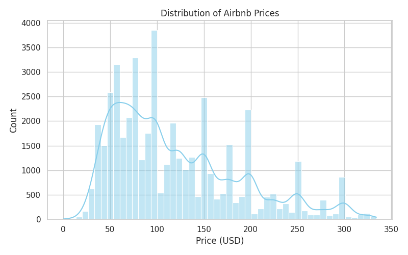
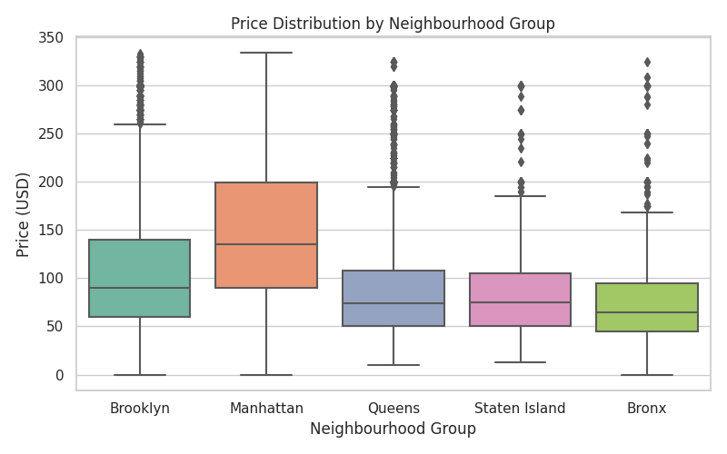
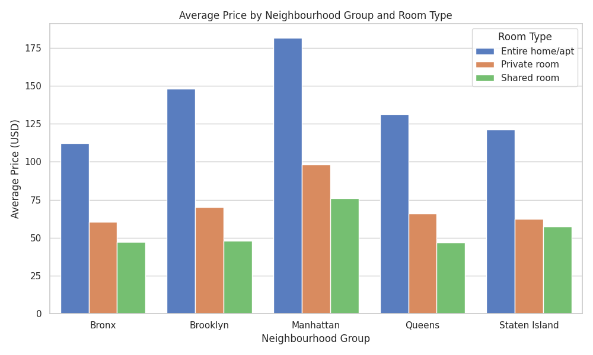

# Projeto 1 – Análise de dados de hospedagens Airbnb de Nova Iorque (2019)

Este projeto faz parte da disciplina **Introdução à Ciência dos Dados** e segue as etapas descritas nos slides do professor Luciano Barbosa. O objetivo é selecionar uma base de dados pública do Kaggle, realizar pré‑processamento, gerar estatísticas descritivas com visualizações e conduzir um teste de hipóteses. Como exemplo, optamos pelo conjunto de dados **[NYC Airbnb 2019](https://www.kaggle.com/datasets/dgomonov/new-york-city-airbnb-open-data)**, que contém informações sobre cerca de 49&nbsp;mil anúncios de hospedagem na cidade de Nova Iorque.

## 1. Coleta de dados

O conjunto de dados foi obtido no Kaggle e contém diversas colunas, como:

| coluna | descrição |
|-------|-----------|
| `id` | identificador do anúncio |
| `name` | nome do anúncio |
| `host_id` e `host_name` | identificadores do anfitrião |
| `neighbourhood_group` | região administrativa de Nova Iorque (Bronx, Brooklyn, Manhattan, Queens, Staten Island) |
| `neighbourhood` | bairro específico |
| `latitude`/`longitude` | coordenadas geográficas |
| `room_type` | tipo de acomodação (ex.: *Entire home/apt*, *Private room*, *Shared room*) |
| `price` | valor da diária em dólares |
| `minimum_nights` | número mínimo de noites |
| `number_of_reviews` | total de avaliações recebidas |
| `last_review` | data da última avaliação |
| `reviews_per_month` | média de avaliações por mês |
| `calculated_host_listings_count` | número de anúncios do mesmo anfitrião |
| `availability_365` | disponibilidade em dias ao longo do ano |

O arquivo original (`AB_NYC_2019.csv`) está incluído neste repositório.

## 2. Pré‑processamento dos dados

### Definição de tipos

* A coluna `last_review` foi convertida para o tipo **datetime** para permitir análises temporais.
* As colunas categóricas (`neighbourhood_group`, `neighbourhood`, `room_type`) foram tratadas como *categorical* no pandas para otimizar o uso de memória.

### Tratamento de dados ausentes

* As variáveis `name` e `host_name` possuíam poucos valores ausentes e não foram usadas nas análises, portanto foram mantidas sem alteração.
* As colunas `last_review` e `reviews_per_month` apresentavam ~10&nbsp;mil valores nulos. A data da última avaliação foi convertida para `NaT` (data faltante) e, para `reviews_per_month`, optou‑se por substituir nulos por **0**, interpretando que anúncios sem avaliações recentes recebem 0 avaliações por mês.
* Linhas sem informações de `neighbourhood_group` ou `room_type` foram removidas por serem essenciais para as comparações.

### Normalização e discretização

* Foi criada a coluna `price_zscore`, representando o **z‑score** (normalização) do preço, calculado como \((x - \bar{x}) / s\). Essa transformação é útil para comparar preços em uma escala padronizada.
* Para discretizar o preço, a coluna `price_bin` classifica o valor em três faixas (\*low\*, \*medium\*, \*high\*) com base nos tercis da distribuição. Essa discretização facilita análises categóricas.

### Limpeza de dados

* Utilizou‑se o método do **intervalo interquartil (IQR)** para remover outliers de preço. Valores abaixo de \(Q1 - 1{,}5 \times IQR\) ou acima de \(Q3 + 1{,}5 \times IQR\) foram descartados.
* Após a remoção de outliers, o conjunto final possui **45&nbsp;923** registros (redução de ~7% dos dados).

## 3. Estatísticas descritivas e visualizações

As estatísticas descritivas básicas (contagem, média, desvio‑padrão, mínimos, máximos e quartis) para as principais variáveis numéricas estão disponíveis em [`summary_statistics.csv`](summary_statistics.csv). Alguns destaques:

* O preço médio das diárias ficou em torno de **US$ 141**, com desvio‑padrão de **US$ 49** e preços variando entre **US$ 0** e **US$ 334** após a remoção de outliers.
* O número mínimo de noites exigido em um anúncio varia de 1 até 1 250 noites, porém a mediana é de apenas 3 noites.
* A maioria das acomodações possui poucas avaliações mensais (mediana 0), mas há anúncios com até 58,5 avaliações por mês.

### Distribuição de preços



O histograma mostra que a maior parte das diárias está abaixo de **US$ 200**. Existe uma cauda longa à direita, mas os outliers extremos foram removidos pelo método do IQR.

### Comparação por região e tipo de quarto



O boxplot deixa claro que **Manhattan** concentra os preços mais altos, seguida de **Brooklyn**. **Staten Island** e **Queens** apresentam preços medianos bem inferiores.



No gráfico de barras, nota‑se que os apartamentos/ casas inteiras (*Entire home/apt*) são consistentemente mais caros em todas as regiões. Já quartos compartilhados (*Shared room*) e quartos privados (*Private room*) apresentam preços bem menores.

## 4. Teste de hipóteses

Para verificar se há diferenças significativas no preço médio entre as regiões (Bronx, Brooklyn, Manhattan, Queens e Staten Island) foi aplicado um **teste ANOVA de uma via**. A hipótese nula afirma que todas as regiões têm o mesmo preço médio. O resultado está em `anova_results.txt`:

```text
F‑statistic: 1509.198
p‑value:    0.00000
```

Como o valor de p é < 0,05, rejeita‑se a hipótese nula. Assim, **existem diferenças estatisticamente significativas entre as médias de preço das regiões**. Isso é confirmado visualmente nos gráficos, com Manhattan sendo a região mais cara.

## 5. Bônus

Além das etapas básicas, este projeto inclui:

* **Normalização e discretização** de variáveis (não abordadas em todas as aulas), facilitando comparações e segmentações.
* **Remoção sistemática de outliers** utilizando o IQR, limpando a base para análises mais confiáveis.

## Como reproduzir

1. Certifique‑se de ter o Python 3 e as bibliotecas `pandas`, `numpy`, `matplotlib`, `seaborn` e `scipy` instaladas.
2. Salve o arquivo `AB_NYC_2019.csv` na pasta do projeto.
3. Execute o script `analysis.py` a partir do diretório `project1`:

```bash
cd project1
python analysis.py
```

O script carregará o conjunto de dados, aplicará as transformações, gerará os gráficos (salvos em `project1/figures/`), exportará as estatísticas descritivas e gravará os resultados do teste ANOVA.

## Conclusões

O estudo evidencia que a localização e o tipo de acomodação influenciam fortemente o preço das hospedagens em Nova Iorque. Manhattan apresenta os preços mais elevados, enquanto Staten Island tem as diárias mais baixas. A disponibilidade de avaliações e o número de noites exigidas variam, mas não parecem impactar diretamente o preço médio. A análise demonstra o poder das ferramentas de pré‑processamento e visualização para extrair insights de conjuntos de dados públicos.